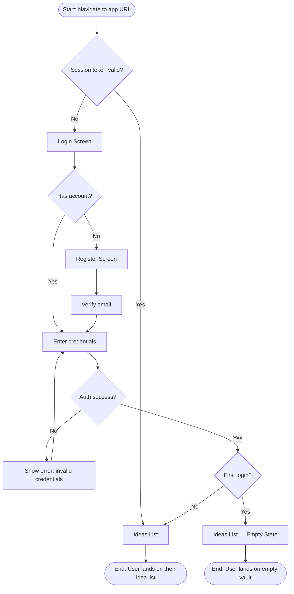
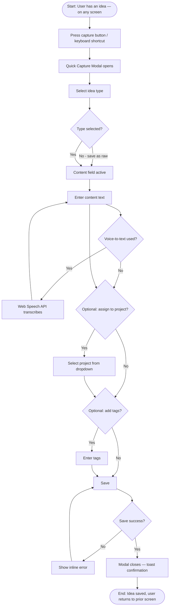
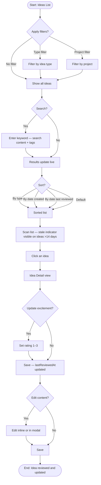
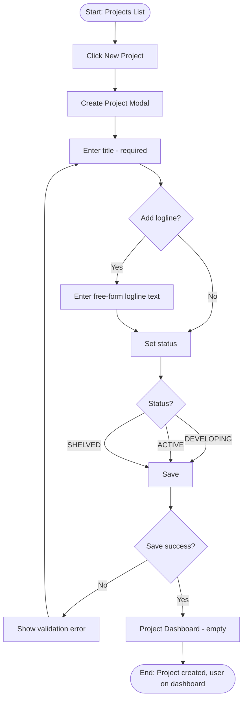
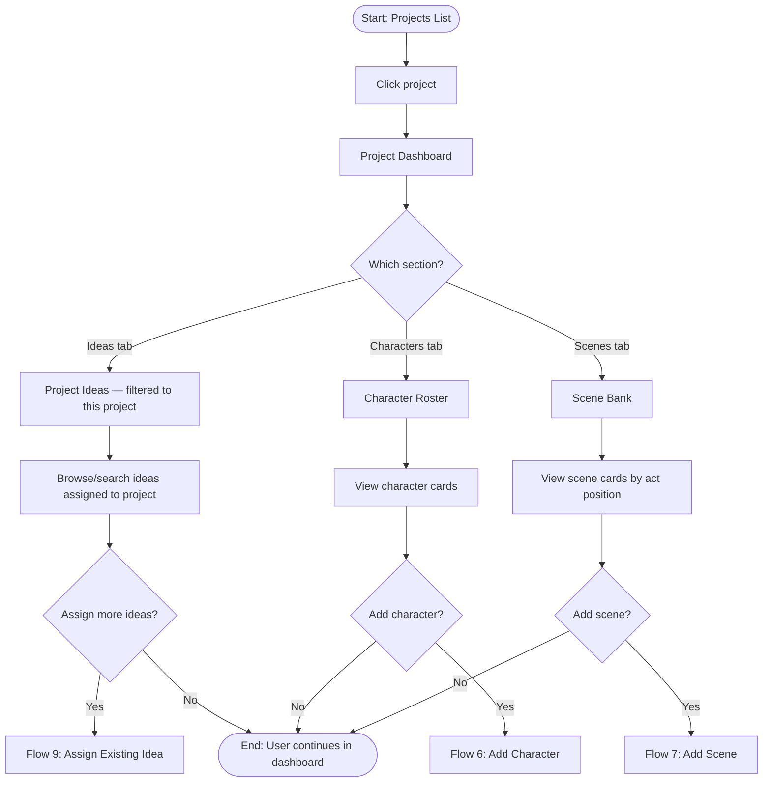
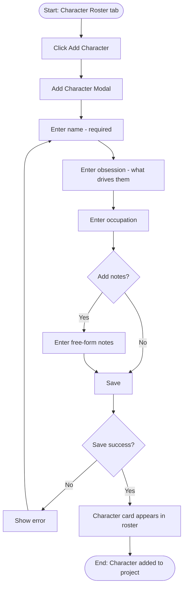
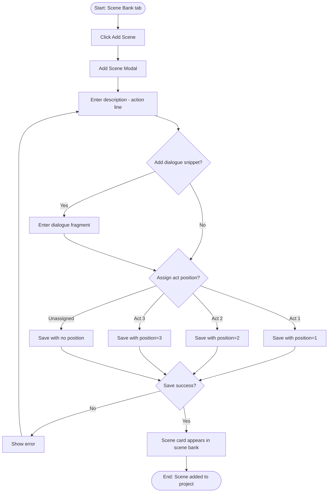
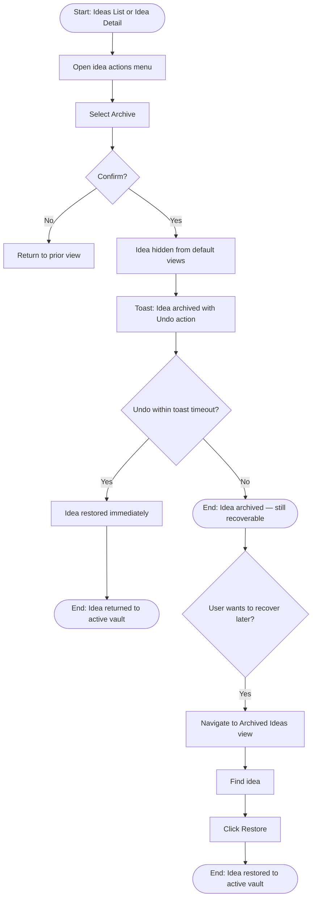
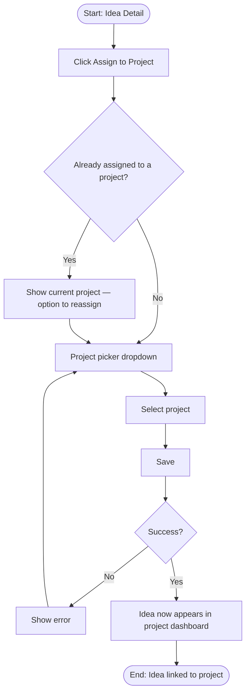
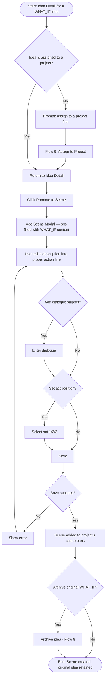

# User Flows: Screenplay Idea Vault

**Status**: DRAFT — PENDING REVIEW
**Version**: 1.0
**Date**: 2026-03-22
**Requirements source**: `docs/requirements/screenplay-idea-vault-requirements.md`

---

## Flow 1: Authentication / First Login

**Actor**: User
**Goal**: Access the application
**Precondition**: App is deployed; user has a Cognito account (or is registering for the first time)

**Key decision points**:
- Valid session → skip login entirely (Amplify session management)
- First login → show empty state with onboarding prompt

**Screens involved**: Login Screen, Register Screen, Ideas List (Empty State), Ideas List

---

## Flow 2: Quick Capture a New Idea

**Actor**: User
**Goal**: Record a fleeting idea before it disappears
**Precondition**: User is authenticated and anywhere in the app

**Key decision points**:
- Type can be left blank → idea is saved as raw/untyped (FR-11 indicator applies)
- Project assignment is optional at capture time (FR-03)
- Voice-to-text is on-device via Web Speech API (FR-06)

**Screens involved**: Quick Capture Modal (overlay — appears on any screen)

---

## Flow 3: Browse, Search & Review Ideas

**Actor**: User
**Goal**: Find ideas, assess staleness, update excitement ratings
**Precondition**: User is authenticated; at least one idea exists

**Key decision points**:
- Stale indicator (FR-10): shown on ideas where `lastReviewedAt` > 14 days ago
- Raw indicator (FR-11): shown on ideas with no type assigned
- Updating excitement rating implicitly sets `lastReviewedAt`
- Search is client-filtered or API-filtered across `content` and `tags[]`

**Screens involved**: Ideas List, Idea Detail

---

## Flow 4: Create a Screenplay Project

**Actor**: User
**Goal**: Start organizing ideas under a named screenplay
**Precondition**: User is authenticated

**Key decision points**:
- Logline is free-form text, fully optional at creation (FR-14)
- Status defaults to DEVELOPING

**Screens involved**: Projects List, Create Project Modal, Project Dashboard (empty state)

---

## Flow 5: Project Dashboard Navigation

**Actor**: User
**Goal**: Work within a screenplay project — view and navigate ideas, characters, scenes
**Precondition**: Project exists; user navigates to it

**Key decision points**:
- Dashboard is tab-based: Ideas | Characters | Scenes
- Ideas tab shows only ideas assigned to this project
- Each tab has its own Add action

**Screens involved**: Projects List, Project Dashboard, Project Ideas (tab), Character Roster (tab), Scene Bank (tab)

---

## Flow 6: Add a Character to a Project

**Actor**: User
**Goal**: Create a character record anchored to a screenplay
**Precondition**: User is on the Project Dashboard > Characters tab

**Key decision points**:
- Name is required; all other fields optional but encouraged by UI labels
- Obsession field is the craft-core field (what they *want*)

**Screens involved**: Character Roster (tab), Add Character Modal

---

## Flow 7: Add a Scene to a Project

**Actor**: User
**Goal**: Capture a scene idea into the project's scene bank
**Precondition**: User is on the Project Dashboard > Scenes tab

**Key decision points**:
- Description is an action line (FR-20): not prose, not internal thought
- Act position is optional; unpositioned scenes appear in a general pool
- Scene Bank can be filtered by act position (FR-21)

**Screens involved**: Scene Bank (tab), Add Scene Modal

---

## Flow 8: Archive & Recover an Idea

**Actor**: User
**Goal**: Remove a low-interest idea from the active vault without permanently deleting it
**Precondition**: User is on the Ideas List or Idea Detail

**Key decision points**:
- Archive is soft delete (FR-13): idea remains in DB, hidden from default list
- Undo toast provides immediate recovery within ~5s
- Archived Ideas view is accessible (exact navigation TBD — filter toggle or separate route)

**Screens involved**: Ideas List, Idea Detail, Archived Ideas View

---

## Flow 9: Assign an Existing Idea to a Project

**Actor**: User
**Goal**: Connect a free-floating idea to a screenplay project
**Precondition**: Idea exists in the vault (unassigned or already assigned); project exists

**Key decision points**:
- An idea can be reassigned from one project to another
- Assignment is stored on the Idea record as `projectId` (see constitution)

**Screens involved**: Idea Detail, Project Picker (dropdown within detail)

---

## Flow 10: Promote a What-If Idea → Scene

**Actor**: User
**Goal**: Elevate a raw premise spark into a structured scene record (FR-22)
**Precondition**: A WHAT_IF idea exists; a project exists

**Key decision points**:
- Idea must be assigned to a project before promotion (scene needs a `projectId`)
- WHAT_IF content pre-populates the scene description as a starting point, not as final copy
- Original idea is optionally archived after promotion (user chooses)

**Screens involved**: Idea Detail, Add Scene Modal, Scene Bank

---

## Screen Inventory

| Screen Name | Description | Flows | Notes |
|---|---|---|---|
| Login Screen | Cognito-hosted or custom auth form | 1 | Public route |
| Register Screen | New account creation | 1 | Public route |
| Ideas List | Main vault — all ideas, searchable/filterable | 1, 3, 8 | Default landing after login |
| Ideas List — Empty State | First-login or zero-idea state with prompt | 1 | Onboarding call-to-action |
| Quick Capture Modal | Global overlay for fast idea entry | 2 | Accessible from any screen via FAB/shortcut |
| Idea Detail | View and edit a single idea | 3, 8, 9, 10 | Also shows stale/raw indicators |
| Archived Ideas View | Browse soft-archived ideas | 8 | Filter toggle or `/archived` route |
| Projects List | All screenplay projects | 4, 5 | Secondary top-level nav item |
| Create Project Modal | New project form | 4 | Logline optional |
| Project Dashboard | Hub for a single project — tabbed | 5 | Three tabs: Ideas, Characters, Scenes |
| Project Ideas (tab) | Ideas filtered to this project | 5, 9 | Subset of Ideas List |
| Character Roster (tab) | All characters in the project | 5, 6 | Card-based layout |
| Add Character Modal | New character form | 6 | Name + obsession required in UX |
| Scene Bank (tab) | All scenes — filterable by act | 5, 7, 10 | FR-21: filter by act 1/2/3 |
| Add Scene Modal | New scene form; reused for promotion | 7, 10 | Pre-filled when promoting from WHAT_IF |
| Project Picker (dropdown) | Inline project selector on Idea Detail | 9 | Not a full screen — inline UI element |

---

## Navigation Structure

**Entry points**
- `/login` — unauthenticated landing
- `/` → redirects to `/ideas` after auth

**Primary navigation** (persistent top-nav or sidebar)
- **Ideas** → `/ideas` — the main vault
- **Projects** → `/projects` — screenplay project list

**Sub-navigation (within Project Dashboard)**
- `/projects/:id` → defaults to Ideas tab
- `/projects/:id/characters`
- `/projects/:id/scenes`

**Global persistent element**
- **Quick Capture button** (FAB or keyboard shortcut `N`) — available on all authenticated routes, opens Quick Capture Modal as an overlay

**Back / breadcrumb navigation**
- Project Dashboard → Projects List (breadcrumb)
- Idea Detail → Ideas List or Project Ideas tab (back button, context-aware)

**Exit points**
- Completing a capture → returns to prior screen
- Archiving an idea → returns to Ideas List
- Completing a project create → lands on new Project Dashboard
